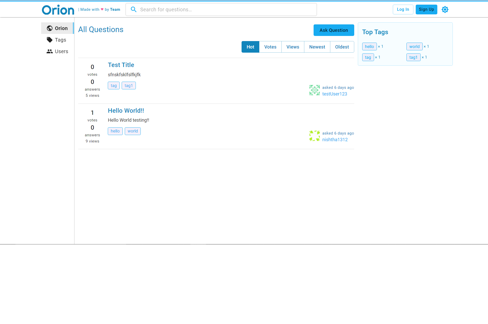
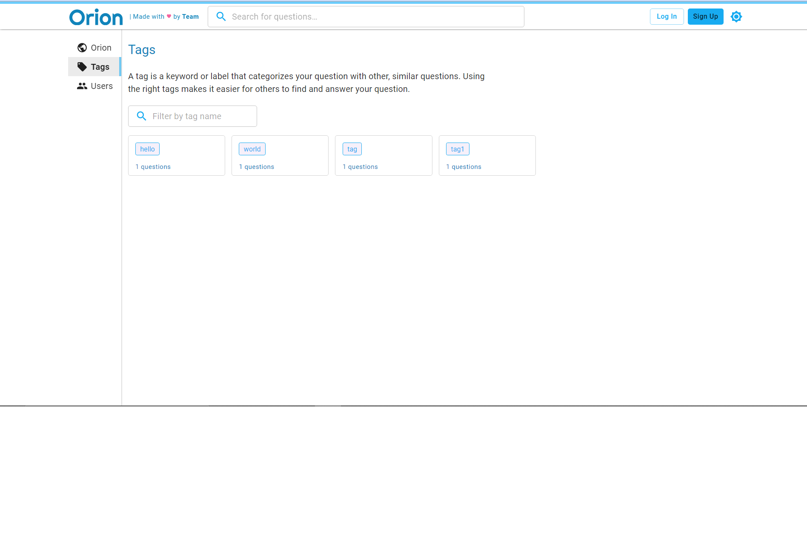

<h1>Orion</h1>

 Orion was designed and developed by an enthusiastic  team of 3 to present an Institute specific discussion  forum as a proof of concept. The project was greenlit  by the Coding Club of IIT Guwahati and we thank  them for their innovative ideas.

  

<h3>HomePage </h3>

 

  

<h3>Question Page</h3>

 

  

<h3>Sign-Up here!!</h3>

 

  

<h3>Find relevent questions using Tags</h3>

 

  

<h3>Answer to all your questions will be posted here!!</h3>

 

  

<h3>Keep track of your Questions and Answers on your Profile :)</h3>

 

